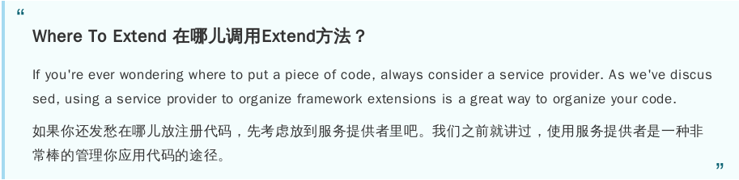
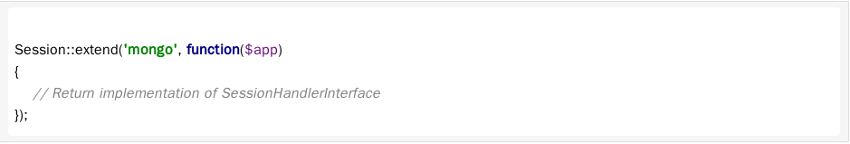
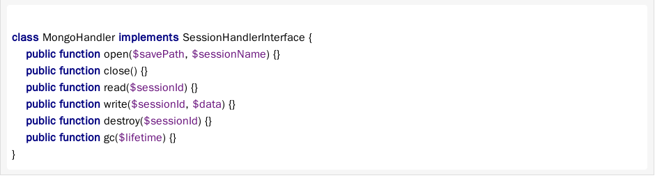
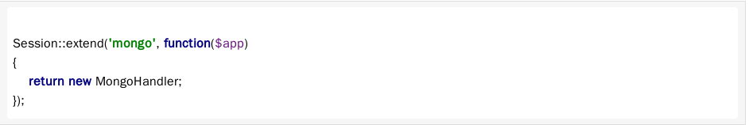
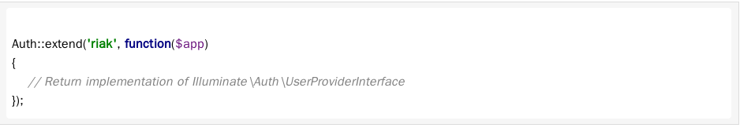

# Extending The Framework #

## Introduction ##

> Methods Of Extension:  Laravel components are typically extended in one of two ways: IoC bindings and the `Manager` classes.

> The manager classes serve as an implementation of the “factory” design pattern, and are responsible for instantiating driver based facilities such as cache and session.

## Manager & Factories ##

> Laravel has several Manager classes that manage the creation of driver-based components.

> The manager class is responsible for creating a particular driver implementation based on the application's configuration.

> For example, the CacheManager class can create APC, Memcached, Native, and various other implementations of cache drivers.

> Learn About Your Managers: All manager classes extend the `Illuminate\Support\Manager` base class, which provides some helpful, common functionality for each manager.

## Cache ##

> To extend the Laravel cache facility, we will use the `extend` method on the `CacheManager`

    Cache::extend('mongo', function($app)
    {
        // Return Illuminate\Cache\Repository instance...
    });

> The first argument passed to the `extend` method is the name of the driver. This will correspond to your `driver` option in the `app/config/cache.php` configuration file. The second argument is a Closure that should return an `Illuminate\Cache\Repository instance`.

> To create our custom cache driver, we first need to implement the `Illuminate\Cache\StoreInterface` contract. So, our MongoDB cache implementation would look something like this:

    class MongoStore implements Illuminate\Cache\StoreInterface {
        public function get($key) {}
        public function put($key, $value, $minutes) {}
        public function increment($key, $value = 1) {}
        public function decrement($key, $value = 1) {}
        public function forever($key, $value) {}
        public function forget($key) {}
        public function flush() {}
    }

> Once our implementation is complete, we can finish our custom driver registeration:

    use Illuminate\Cache\Repository;

    Cache::extend('mongo', function($app)
    {
        return new Repository(new MongoStore);
    }

> you may use the base `Illuminate\Cache\Repository` when creating custom cache drivers. These is typically no need to create your own repository class.

> If you're wondering where to put your custom cache driver code, consider making it available on Packagist! Or, you could create an `Extensions` namespace within your application's primary folder. For example, if the application is named `Snappy`, you could place the cache extension in `app/Snappy/Extensions/MongoStore.php`.

## Session ##

## Authentication ##

> The `UserProviderInterface` implementations are only responsible for fetching a `UserInterface` implementation out of persistent storage system, such as MySQL, Riak, etc.

> These two interfaces allow the Laravel authentication mechanisms to continue functioning regardless of how the user data is stored or what type of class is used to represent it.

    interface UserProviderInterface {
        public function retrieveById($identifier);
        public function retrieveByCredentials(array $credentials);
        public function validateCredentials(UserInterface $user, array $credentials);
    }

    interface UserInterface {
        public function getAuthIdentifier();
        public function getAuthPassword();
    }

    Auth::extend('riak', function($app)
    {
        return new RiakUserProvider($app['riak.connection']);
    });

> After you have registered the driver with the `extend` method, you switch to the new driver in your `app/config/auth.php` configuration file.

## IoC Based Extension ##

> For example, the `PaginationServiceProvider` binds a `paginator` key into the IoC container, which resolves into `Illuminate\Pagination\Environment` instance.

    namespace Snappy\Extensions\Pagination;
    class Environment extends \Illuminate\Pagination\Environment {
        //
    }

    class SnappyPaginationProvider extends PaginationServiceProvider {
        public function boot()
        {
            App::bind('paginator', function()
            {
                return new Snappy\Extensions\Pagination\Environment;
            }

            parent::boot();
        }
    }

> Note that this class extends the `PaginationServiceProvider`, not the default `ServiceProvider` base class. Once you have extended the service provider, swap out the `PaginationServiceProvider` in your `app/config/app.php` configuration file with the name of your extended provider.

> Essentially every core class is bound in the container in this fashion, and can be overridden.

## Request Extension ##

> Because it is such a foundational piece of the framework and is instantiated very early in the request cycle, extending the `Request` class works a little differently than the previous examples.

    namespace QuickBill\Extensions;
    class Request extends \Illuminate\Http\Request {
        // Custom, helpful methods here...
    }

> Once you have extended the class, open the `bootstrap/start.php`Note that the first action performed is the creation of the Laravel $app instance file. This file is one of the very first files to be included on each request to your application.

> Note that the first action performed is the creation of the Laravel $app instance:

    $app = new \Illuminate\Foundation\Application;

> When a new application instance is created, it will create a new `Illuminate\Http\Request` instance and bind it to the IoC container using the `request` key.

> we need a way to specify a custom class that should be used as the “default” request type

> the `requestClass` method on the application instance does just this!

> we can add this line at the very top of our `bootstrap/start.php` file:

    use Illuminate\Foundation\Application;
    Application::requestClass('QuickBill\Extensions\Request');

