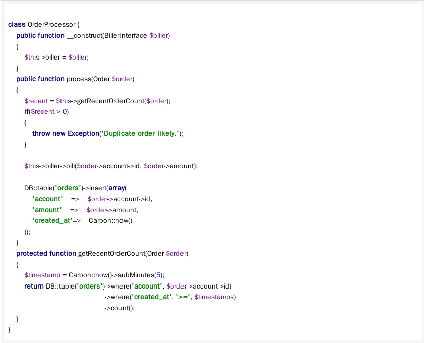
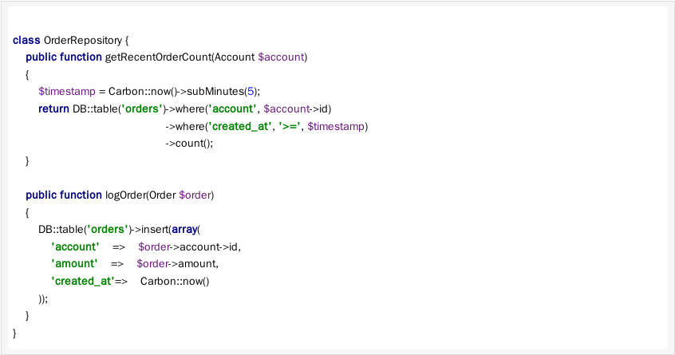
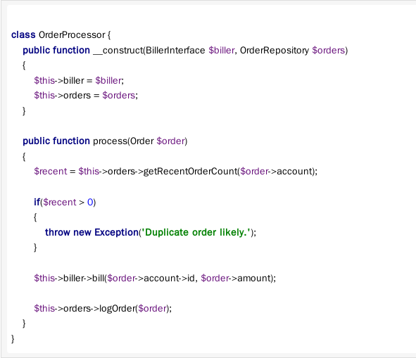

# Single Responsibility Principle #

**@Reference: [Laradiner讀書會-SOLID-原則](http://blog.dj1020.net/Laradiner%E8%AE%80%E6%9B%B8%E6%9C%83-SOLID-%E5%8E%9F%E5%89%87-2016-01-21/)**

## Introduction ##

> The “SOLID” design principles, articulated by Robert “Uncle Bob” Martin, are five principles

- Single Responsibility Principle
- Open Closed Principle
- Liskov Substitution Principle
- Interface Segregation Principle
- Dependency Inversion Principle

> The Single Responsibility Principle states that a class should have one, and only one, reason to change. In other words, a class' scope and responsibility should be narrowly focused.

> A class should do its job, and should not be affected by changes to any of its dependencies.

The following class without SPR:

> based on the getRecentOrderCount method, we can also see that it is responsible for examining an account's order history in the database in order to detect duplicated orders.

> This extra validation responsibility means that we must change our order processor when our data store changes, as well as when our order validation rules change.

> We should extract this responsibility into another class, such as an OrderRepository:

> we can inject our repository into the `OrderProcessor`, alleviating it of the responsibility of researching an account's order history:

> we no longer have to change our OrderProcessor when the method of retrieving and logging orders changes
